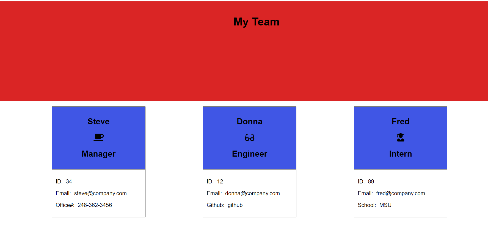

# 10: Object Oriented Programming:  Team Profile Generator

## Description

A Node.js command-line application that takes information about employees on a software engineering team and generates an HTML website that displays summaries for each person.

### Technologies Used

* Jest
* JavaScript
* Inquirer
* CSS

### Screenshot

https://bussudo.github.io/MyTeamList.git/
